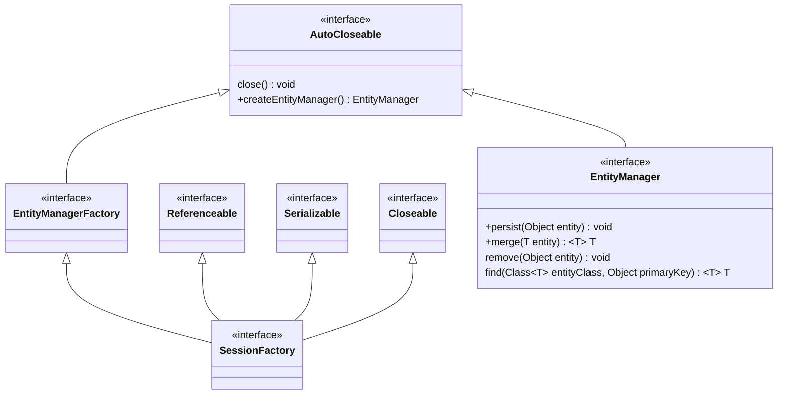

# Factory Method

Class Diagram
---

```mermaid

classDiagram

class SessionFactory{
<<interface>>
}


class EntityManagerFactory{
<<interface>>
}
class Referenceable{
<<interface>>
}
class Serializable{
<<interface>>
}
class Closeable{
<<interface>>
}

EntityManagerFactory <|-- SessionFactory
Referenceable <|-- SessionFactory
Serializable <|-- SessionFactory
Closeable <|-- SessionFactory

AutoCloseable <|-- EntityManagerFactory

class AutoCloseable{
<<interface>>
close() void
+createEntityManager() EntityManager
}

AutoCloseable <|-- EntityManager

class EntityManager{
<<interface>>

+persist(Object entity) void
+merge(T entity)~T~ T 
remove(Object entity) void
find(Class~T~ entityClass, Object primaryKey) ~T~ T

}


```